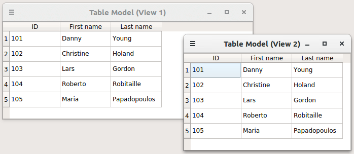

# Table Model Example

- https://doc.qt.io/qt-6/qtsql-tablemodel-example.html
- https://code.qt.io/cgit/qt/qtbase.git/tree/examples/sql/tablemodel?h=6.4

The Relational Table Model example shows how to use table views with a relational model to visualize the relations between items in a database.

[Example project @ code.qt.io][books]

[//]: # (These are reference links used in the body of this note and get stripped out when the markdown processor does its job. There is no need to format nicely because it shouldn't be seen. Thanks SO - http://stackoverflow.com/questions/4823468/store-comments-in-markdown-syntax)

   [books]: <https://code.qt.io/cgit/qt/qtbase.git/tree/examples/sql/books?h=6.4>